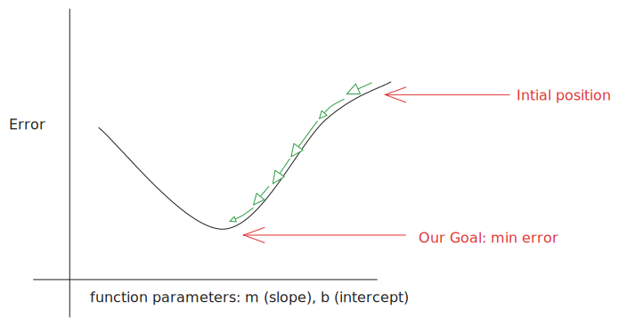

# Linear Regression Visualizer

An interactive web application designed to help users understand and visualize linear regression by plotting custom data points and instantly calculating and displaying the best-fit line.

## Getting Started

To get the application running locally, follow these simple steps.

1. Clone the Repository

```bash
git clone https://github.com/swayam9705/Linear-Regression-Visualizer.git

cd linear-regression-visualizer
```

2. Install dependencies:
```bash
npm install
```

3. Start the application:

```bash
npm run dev
```

## Feature

* **Interactive Data Input**: Easily add custom data points directly on the chart via input form.

* **Real-time Calculation**: The Linear Regression Line is calculated and updated in real-time as data points are added or removed

## Technology Stack


* **Vue.js**:
The core javascript framework for building user interfaces.


* **Pinia**: The state management library for Vue.js similar to Context API in React. Provides simple and modular way to manage application data


* **vue-chart.js**: A chart.js wrapper for Vue.js used to render the interactive scatter plot and regression line.

* **Custom Linear Regression Implementation**: The mathematical framework for the app. The model is calculated from scratch using Least Squared Error and gradient descent.

## Mathematic Framework

### 1. The Goal: Finding the "Line of Best Fit"
Start by defining the simple linear equation. Explain that we want to find the best values for weight ($w$) and bias ($b$) so our line passes as close as possible to all data points.
$$y = mx + b$$

* $x$: The input (e.g Square footage of a house).
* $y$: The prediction (eg. Price of the house).
* Our Goal is to minimize the error between our prediction and actual data.

### 2. Error Function
To improve the models prediction, the obvious thing we can do is to minimize the error as much as possible. For that we calculate the error as the sum of squares of difference between actual and predicted data.

$$E(m, b) = \sum_{i=1}^n{(y_{pred}^{(i)} - y_{actual}^{(i)})^2}$$

### 3. Gradient Step


* **The Gradient**: This tells us the direction of the steepest ascent. To go down, we move in the opposite direction of the gradient.

* **The Learning Rate ($L$)**: This is the "step size."Too large? We might overshoot the bottom.Too small? It will take forever to get there.

## 4. The Update Rule
This function powers our regression model. The Linear Regression uses gradient descent (i.e it is an iterative approach). The model keeps on updating the parameters in such a way that for each next iteration, the error is reduced. These iterations are carried upto a certain number of times known as epochs

$$m = m - L\frac{\delta E}{\delta m}$$
$$b = b - L\frac{\delta E}{\delta b}$$

The $L$ (learning rate) and epochs must be tweaked by the user depending upon the nature of data or in case the overflow condition occurs.